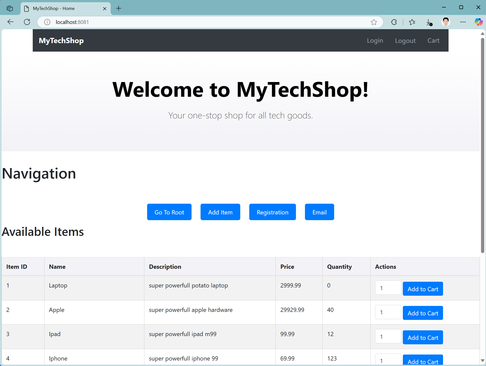
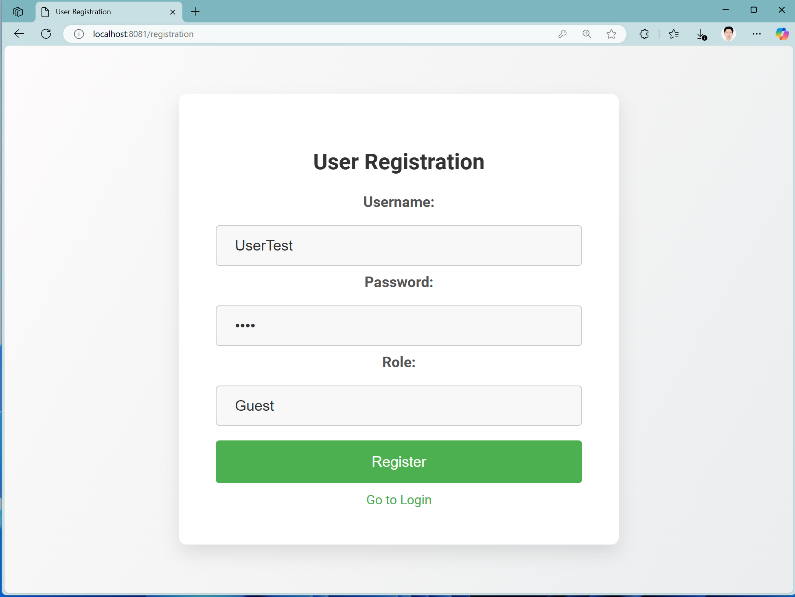
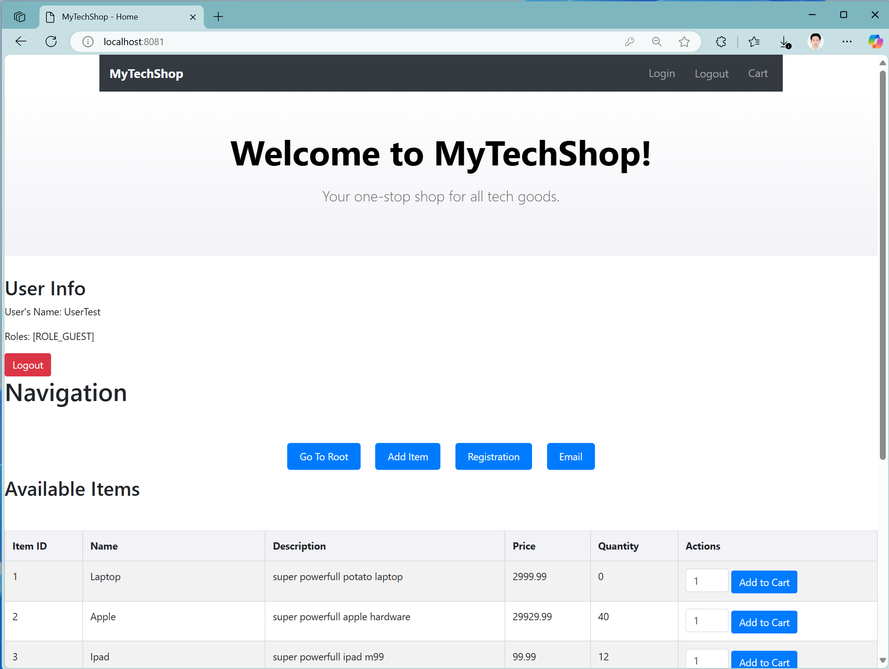
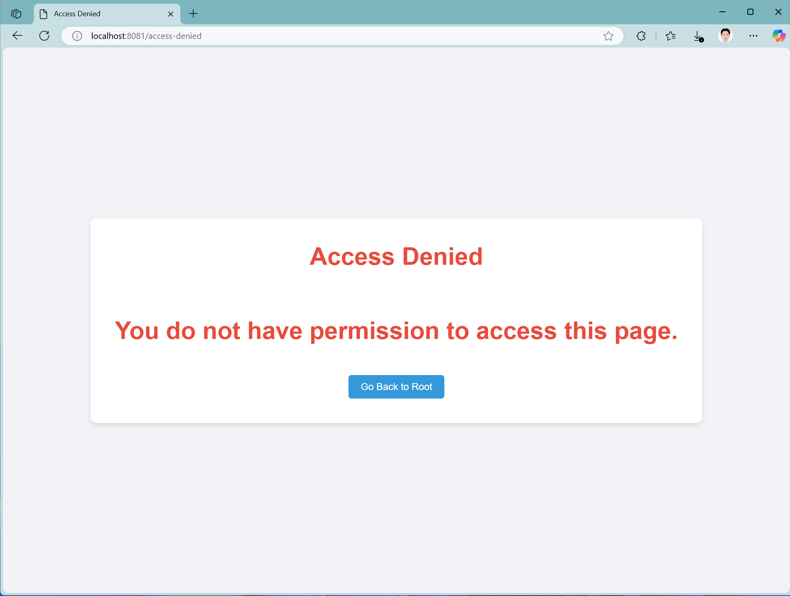
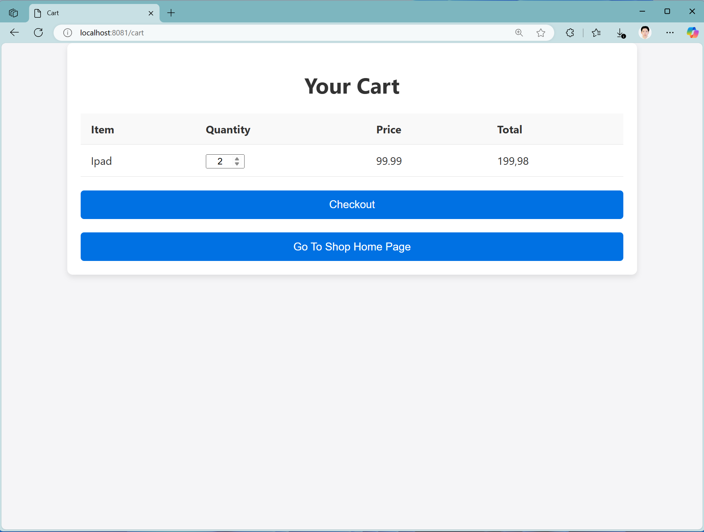
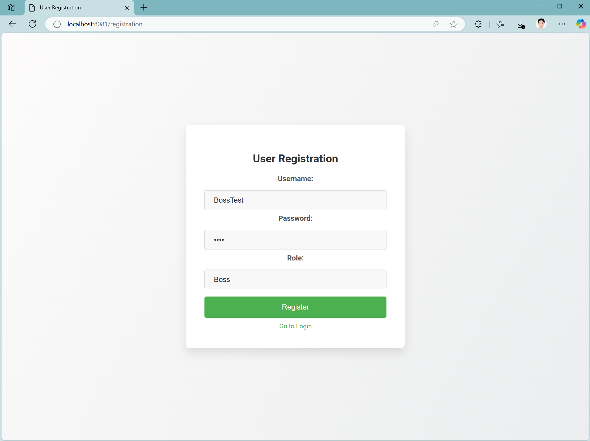
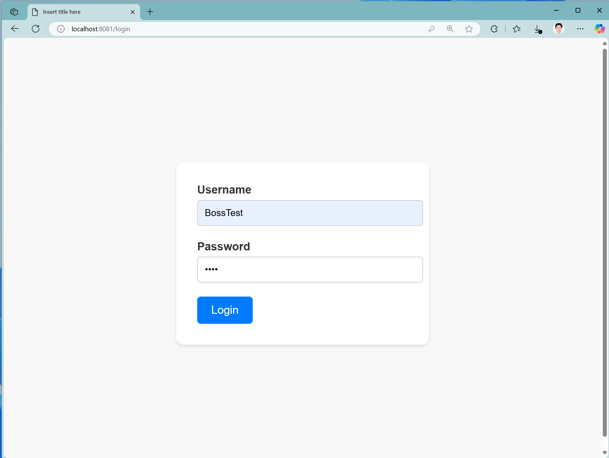
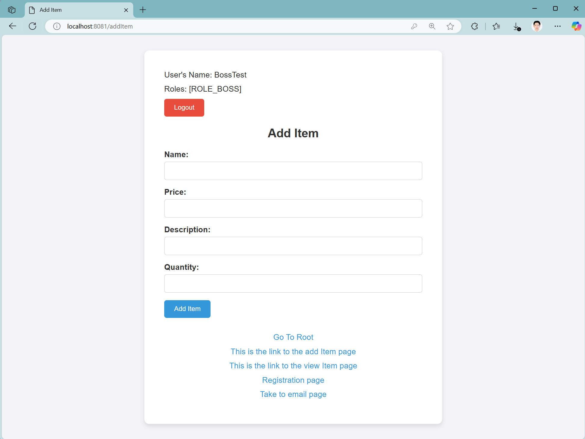
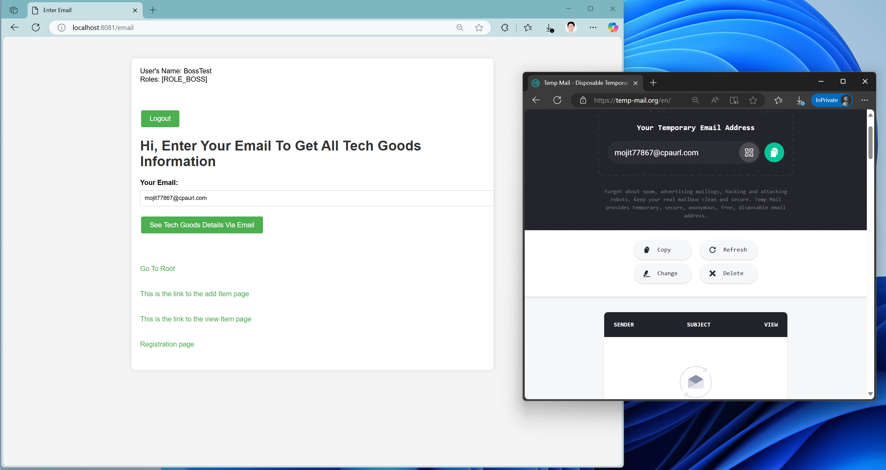
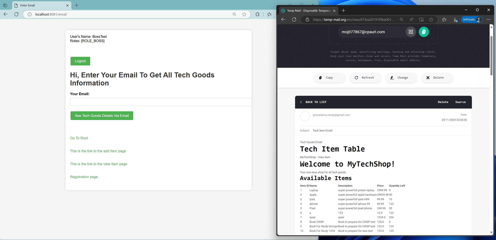

**MyTechShop**

MyTechShop is a Spring Boot-based e-commerce application featuring user authentication, role-based access control, a cart system, and email notifications. It is designed to demonstrate core functionalities like login/logout, user and admin management, and real-time updates on item availability via email.

**Features**
Authentication and Security

User Registration and Login: Users can register and securely log in.

Admin Role: Admins have additional privileges, such as adding new items.

Logout Functionality: Users can securely log out of the application.

Cart System

Cart Management: Users can add items to their cart and manage them.

Admin Capabilities
Add Items: Admins can add new products to the inventory.
View Restrictions: Users without admin privileges are restricted from adding items.

Email Notifications
Item Availability Notification: Sends an email when items are added or become available.

 
  
  

The demoImage directory contains screenshots showcasing the application's features:

homePage.png: Home page interface.

User registration page.

User's home page after login.

User restriction error when attempting unauthorized actions.

CartFeature.png: Cart management page when the user adds the item to the cart.

An Admin registration page.

Admin login page.

 Admin interface for adding items.

Email notification page where the user can get an email of the available item - sent in HTML format.

Confirmation of email being sent.

**Technologies Used**

Java: Primary programming language.

Spring Boot: Framework for backend development.

Spring Security: This is for implementing authentication and authorization.

Thymeleaf: Template engine for the frontend

H2 Database: Embedded database for testing (replaced with MySQL in production).

JavaMailSender: For email functionalities.
